# MicroCoaching Platform — Architecture Document

> **Generated**: 2026-06-08
> **Repository**: `/home/deepak/projects/coaching-platform`
> **Confidence**: High — grounded in `README.md`, `docs/ARCHITECTURE_RESET.md`, source code, and automated repo scan

---

## Table of Contents

1. [Executive Summary](#1-executive-summary)
2. [System Context](#2-system-context)
3. [Technology Stack](#3-technology-stack)
4. [Container / Service Architecture](#4-container--service-architecture)
5. [Component Architecture](#5-component-architecture)
6. [Data Architecture](#6-data-architecture)
7. [Key Workflows](#7-key-workflows)
8. [Infrastructure & Deployment](#8-infrastructure--deployment)
9. [Architectural Decisions](#9-architectural-decisions)
10. [Cross-Cutting Concerns](#10-cross-cutting-concerns)
- [Appendix A — Dependency Graph](#appendix-a--dependency-graph)
- [Appendix B — Annotated File Structure](#appendix-b--annotated-file-structure)
- [Appendix C — Known Unknowns](#appendix-c--known-unknowns)

**Related docs (not duplicated here):**

| Doc | Purpose |
|-----|---------|
| [`README.md`](../README.md) | Canonical endpoint contract and local run commands |
| [`ARCHITECTURE_RESET.md`](ARCHITECTURE_RESET.md) | Corrected v3.3+ domain model and pipeline semantics |
| [`PROJECT_NAVIGATION.md`](PROJECT_NAVIGATION.md) | Where to change code for common tasks |
| [`SETUP_TROUBLESHOOTING.md`](SETUP_TROUBLESHOOTING.md) | Local/dev setup fixes |

---

## 1. Executive Summary

MicroCoaching is a **Python monorepo** that powers AI-assisted health coaching for Community Health Workers (CHWs). It ingests clinical source documents, runs a multi-stage LLM pipeline to produce versioned coaching modules, and exposes sync, telemetry, RAG, and admin APIs to an Android SDK and admin dashboards. The system splits into a **stateful platform service** (PostgreSQL, Redis, ClickHouse, MinIO) and a **stateless AI runtime** (LLM provider adapters only), communicating over a private HTTP API.

**At a glance:**

| Attribute | Value |
|-----------|-------|
| Primary language | Python 3.12 |
| Framework | FastAPI (both services), Celery (async workers) |
| Architecture style | Monorepo microservices — layered MVC inside platform |
| Deployable units | `platform-api`, `platform-celery-worker`, `platform-celery-beat`, `ai-runtime`, `migrate` (one-shot) |
| Data stores | PostgreSQL (+ pgvector when `VECTOR_STORE_BACKEND=pgvector`), Redis, ClickHouse, object storage (MinIO or S3) |
| External dependencies | Google Vertex/Gemini, SPICE auth-service (production), MinIO/S3 |

---

## 2. System Context

MicroCoaching sits between mobile CHW clients and cloud AI infrastructure. The Android SDK and admin web clients call **platform-api** for content sync, coaching Q&A, telemetry ingest, and content management. Platform orchestrates document ingestion, persists all product state, and delegates raw LLM calls to **ai-runtime**. Analytics dashboards (optional, separate repo) read aggregated telemetry via platform dashboard routes.

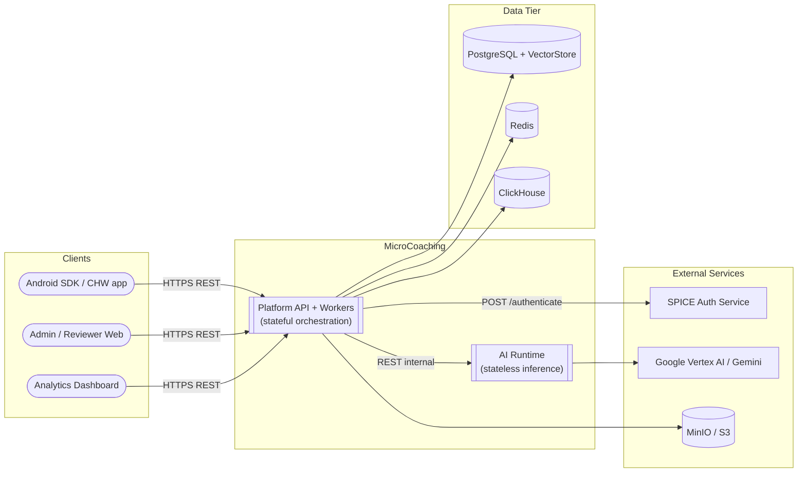

### External Dependencies

| System | Used by | Purpose | Connection |
|--------|---------|---------|------------|
| **SPICE auth-service** | platform-api | JWT validation, admin vs device authorization planes | `POST {SPICE_AUTH_BASE_URL}/authenticate` |
| **Google Vertex AI / Gemini** | ai-runtime | Inference, vision, transcription, embeddings | SDK via ADC or API key |
| **MinIO / S3** | platform-api, workers | Source documents, thumbnails, admin file assets | S3-compatible API |
| **Analytics dashboard** (separate repo) | Browser | Program-manager analytics UI | Calls platform dashboard routes |

### Users & Clients

| Actor | Calls | Purpose |
|-------|-------|---------|
| **CHW Android SDK** | Device-plane routes (`/coaching`, `/sync`, `/telemetry`, `/morning`) | Offline sync, coaching RAG, telemetry upload, morning cards |
| **Admin / reviewer web** | Admin-plane routes (`/admin/*`) | Ingest sources, manage modules, trigger bindings, inspect pipeline runs |
| **Program managers** | Dashboard routes (`/dashboard/*`) | Supervisor and LLM-quality analytics |
| **platform-celery-worker** | Internal (Redis broker) | Background ingest, post-publish jobs, telemetry processing |
| **platform-api** | ai-runtime internal API | All LLM generation, embedding, transcription |

---

## 3. Technology Stack

| Category | Technology | Version / notes | Purpose | Rationale |
|----------|------------|-----------------|---------|-----------|
| Language | Python | 3.12 | All services and packages | Team standard; strong async + ML ecosystem |
| Package manager | uv | workspace monorepo | Dependency lock, multi-package sync | Fast, reproducible installs across 5 workspace members |
| Web framework | FastAPI | per `uv.lock` | HTTP APIs for platform and ai-runtime | Async-native, OpenAPI, Pydantic v2 integration |
| ORM | SQLAlchemy 2.x | async (`asyncpg`) | PostgreSQL access in platform | Mature async support; Alembic integration |
| Migrations | Alembic | `infra/alembic` | Schema versioning | Separate from app startup (explicit upgrade step) |
| Vector search | `mc_foundation.VectorStore` + adapter | Default backend: pgvector | Module embeddings for RAG and semantic search | Call sites are vendor-agnostic; pgvector co-locates vectors with relational module data today |
| Primary DB | PostgreSQL 15 | pgvector image | System of record | ACID, JSONB, range types for visibility windows |
| Analytics DB | ClickHouse | 24.4 | Telemetry events, materialized summaries | Columnar OLAP for high-volume event ingest |
| Cache / queue broker | Redis 7 | Celery broker | Job queue, rate-limit state | Lightweight; no Celery result backend by design |
| Task queue | Celery | platform workers | Ingest pipeline, post-publish, telemetry drain | Mature Python async job orchestration |
| Object storage | MinIO or AWS S3 | S3 API via boto3 | PDFs, thumbnails, ingest artifacts | Presigned URLs for device offline access |
| AI providers | google-genai | ai-runtime only | LLM inference and embeddings | Provider SDK isolated in stateless service |
| Auth | SPICE middleware | platform | External IdP integration | Enterprise SSO; admin/device plane split |
| Observability | python-json-logger, request IDs | mc_foundation | Structured logs, correlation | Shared across services |
| CI | GitHub Actions | `.github/workflows/ci.yml` | Lint, security scan, typecheck, tests | Gates on `main` and `dev` |
| Containers | Docker Compose | `docker-compose.yml` | Local full stack | Mirrors production topology |

---

## 4. Container / Service Architecture

The repo deploys as **four long-running processes** plus infrastructure and a one-shot migrator. All application images use `python:3.12-slim`; healthchecks use Python `urllib` probes (no `curl` in images).

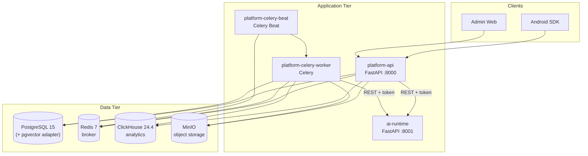

### Services / Containers

#### 4.1 — platform-api

- **Purpose**: Public HTTP API for device sync, coaching RAG, telemetry ingest, admin CRUD, and dashboard analytics.
- **Technology**: Python 3.12, FastAPI, SQLAlchemy async, httpx.
- **Exposes**: HTTP on port 8000; routes under `/medtronics-api` (configurable via `API_ROOT_PATH`).
- **Depends on**: PostgreSQL, Redis, ClickHouse, MinIO, ai-runtime.
- **Entry point**: `services/platform/src/platform_service/main.py`

#### 4.2 — platform-celery-worker

- **Purpose**: Background jobs — v3.3 ingest pipeline (stages A→D), cross-source fusion, post-publish embedding/quiz/gap classification, module-completion telemetry processing, thumbnail generation, telemetry buffer drain.
- **Technology**: Celery + same `platform_service` codebase as API.
- **Exposes**: Consumes Redis broker tasks (no HTTP).
- **Depends on**: PostgreSQL, Redis, MinIO, ai-runtime; ClickHouse for telemetry drain.
- **Entry point**: `celery -A platform_service.celery_app.celery_app worker`

#### 4.3 — platform-celery-beat

- **Purpose**: Scheduled tasks (currently: periodic telemetry buffer drain).
- **Technology**: Celery Beat.
- **Exposes**: Publishes to Redis on interval.
- **Depends on**: Redis, PostgreSQL, ClickHouse, ai-runtime (health at startup).
- **Entry point**: `celery -A platform_service.celery_app.celery_app beat`

#### 4.4 — ai-runtime

- **Purpose**: Stateless LLM provider execution — generation, embedding, transcription.
- **Technology**: Python 3.12, FastAPI, google-genai SDK.
- **Exposes**: Internal HTTP on port 8001 (`/internal/generate/*`, `/internal/embed`, `/internal/transcribe`, `/health`).
- **Depends on**: AI provider credentials only — **no PostgreSQL, Redis, or ClickHouse**.
- **Entry point**: `services/ai-runtime/src/ai_runtime/main.py`

#### 4.5 — migrate (one-shot)

- **Purpose**: Run `alembic upgrade head` before platform services start.
- **Entry point**: `infra/alembic.ini` via platform Dockerfile.

#### 4.6 — Shared packages (libraries, not deployables)

| Package | Purpose |
|---------|---------|
| `packages/contracts` (`mc_contracts`) | Pydantic DTOs, enums, shared API contracts |
| `packages/foundation` (`mc_foundation`) | Config base, structured logging, request ID middleware, HTTP helpers |

---

## 5. Component Architecture

### 5.1 — platform-api Internals

Platform follows a **layered MVC** pattern: FastAPI routers → domain services → repositories → SQLAlchemy models. Cross-cutting auth, rate limiting, and dependency injection sit in middleware and `deps.py`. All AI calls go through `AIRuntimeClient` — platform never imports provider SDKs.

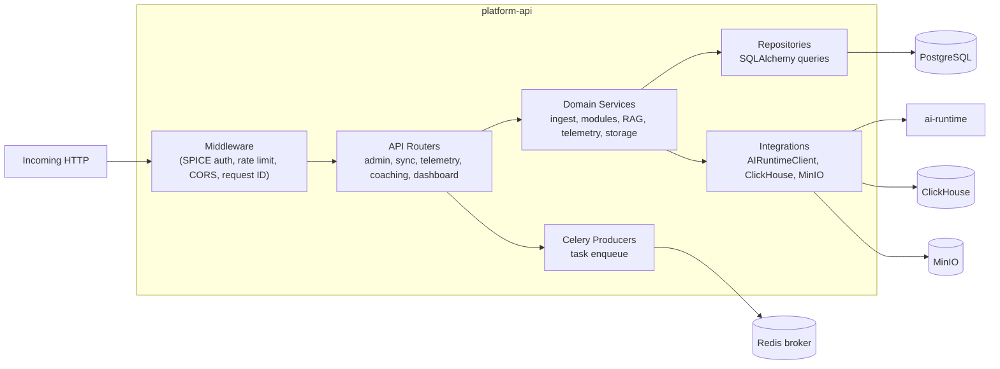

#### Key Modules

| Module / Layer | Responsibility | Key Files |
|----------------|----------------|-----------|
| API routers | HTTP surface, request validation | `api/admin_*.py`, `api/sync.py`, `api/telemetry.py`, `api/coaching_rag.py`, `api/dashboard.py`, `api/morning.py` |
| Auth | SPICE token validation, admin/device planes | `auth/spice_auth_middleware.py`, `auth/spice_authorization_middleware.py`, `auth/rate_limit_middleware.py` |
| Config | Pydantic settings from env | `config.py` |
| DB models | SQLAlchemy entities | `db/models/*.py` |
| Repositories | Persistence queries | `db/repositories/` |
| Integrations | External service clients | `integrations/ai_runtime_client.py`, ClickHouse client and `ObjectStore` via `deps.py` |
| Workers (invoked via Celery) | Ingest pipeline, post-publish | `workers/*.py`, `celery_tasks.py` |
| Contracts | Shared DTOs | `packages/contracts/src/mc_contracts/` |

#### Public API Surface (route groups)

All paths are relative to `API_ROOT_PATH` (default `/medtronics-api`).

| Prefix | Plane | Key endpoints |
|--------|-------|---------------|
| `/coaching` | Device | `POST /rag-query` |
| `/telemetry` | Device | `POST /events` |
| `/sync` | Device | `GET /modules`, `/triggers`, `/gaps`, `/config`; presign batches |
| `/morning` | Device | `GET /cards` |
| `/admin` | Admin | `/ingest`, `/modules`, `/trigger-bindings`, `/fusion`, `/files` |
| `/dashboard` | Admin | `/supervisor/{chw_id}`, `/district/{upazila_id}`, `/llm-quality` |
| — | Ops | `/ready` |

Full contract: [`README.md`](../README.md#canonical-endpoint-contract).

### 5.2 — ai-runtime Internals

ai-runtime is intentionally thin: validate internal token → route to provider adapter → return structured response. No persistence.

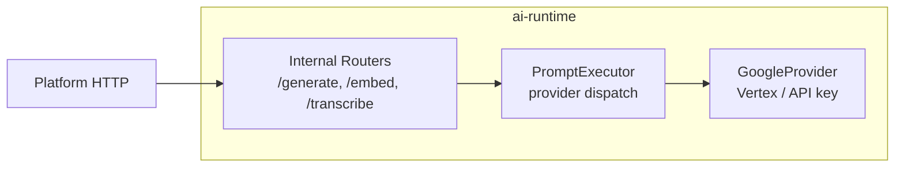

#### Key Modules

| Module | Responsibility | Key Files |
|--------|----------------|-----------|
| API | Internal endpoints | `api/internal_generate.py`, `api/internal_embed.py`, `api/internal_transcribe.py` |
| Services | Provider orchestration | `services/prompt_executor.py` |
| Providers | SDK adapters | `providers/google_provider.py` |
| Config | Provider selection, model defaults | `config.py` |

#### Internal API

| Endpoint | Purpose |
|----------|---------|
| `POST /internal/generate/{generation_type}` | Unified generation (ingest stages, RAG, quiz, etc.) |
| `POST /internal/embed` | Text embeddings (dimension aligned with platform corpus / VectorStore) |
| `POST /internal/transcribe` | Media transcription for ingest |
| `GET /health` | Liveness + active provider name |

---

## 6. Data Architecture

### 6.1 Data Stores

| Store | Type | Purpose | Access pattern |
|-------|------|---------|----------------|
| **PostgreSQL** | Relational (+ pgvector when selected) | Modules, ingestion runs, gaps, CHW state, LLM cache; default home for module vectors | Async SQLAlchemy; platform only |
| **VectorStore** | Protocol + adapter (`mc_foundation`) | Durable embedding upsert/search for RAG and admin semantic search | Platform workers/API/eval via `get_vector_store`; default adapter is pgvector on `module.embedding` |
| **ClickHouse** | Columnar OLAP | Telemetry events (`coaching_events`), materialized views for dashboards | Batch insert on ingest; dashboard reads |
| **Redis** | In-memory | Celery broker, rate-limit counters | Async redis client in API |
| **Object storage** | Blobs | Source PDFs/media, thumbnails, admin uploads | Presigned GET for devices; direct put from workers |

Chat FAQ clustering embeds questions in-process via ai-runtime and never writes to `VectorStore`; it is not a durable vector-store consumer.

### 6.2 Core Data Model

The **module** is the unit of meaning. Cards live inline in `module.module_json` (no per-card tables). Versioning is per `module_family_id`.

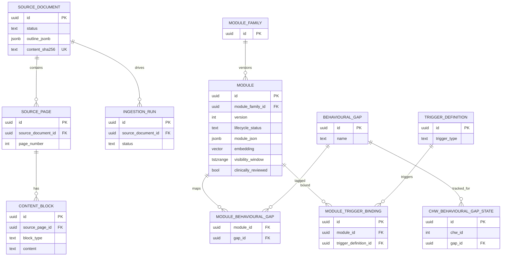

### 6.3 Data Flow

Primary write path: **admin document ingest → published module**.

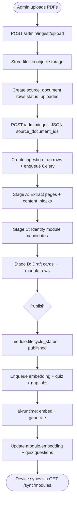

---

## 7. Key Workflows

### 7.1 — Admin Document Ingest (v3.3 Pipeline)

Admin uploads clinical source files. Platform stores them in object storage, creates `source_document` rows, and enqueues a long-running Celery batch. Workers run stages A (extract), C (identify candidates), D (draft modules), optionally merge into existing module families, then publish. Post-publish workers generate embeddings, quizzes, and gap classifications asynchronously.

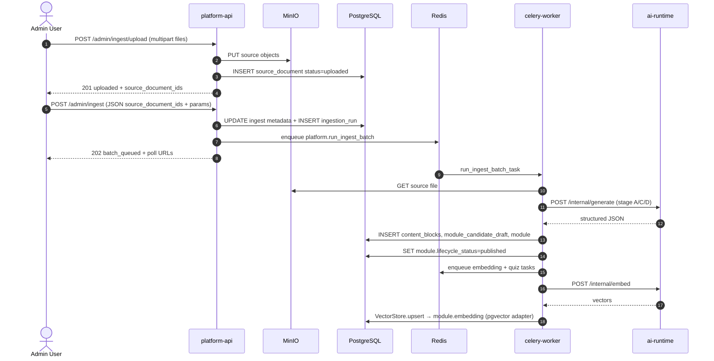

### 7.2 — Coaching RAG Query

CHW asks a question in the app. Platform embeds the question, retrieves similar published modules via `VectorStore.search` (pgvector adapter applies published/tenant/assignable filters in SQL), builds a grounded prompt, and calls ai-runtime for a JSON answer with source attribution.

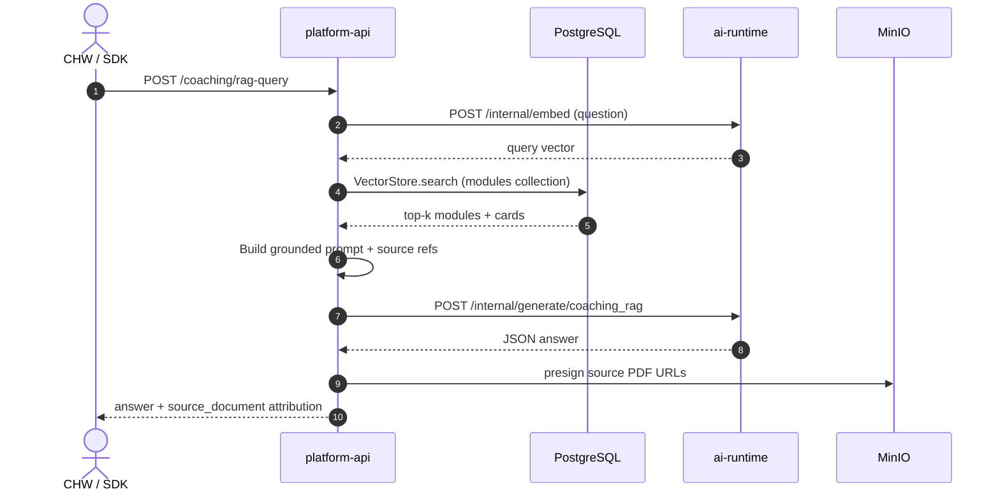

### 7.3 — Telemetry Ingest + Background Processing

SDK batches telemetry events. Platform validates, writes to ClickHouse for analytics, and enqueues Redis jobs for module-completion and gap-state updates in PostgreSQL.

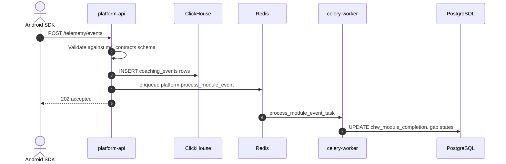

---

## 8. Infrastructure & Deployment

Local development uses **Docker Compose** (`docker-compose.yml`). CI runs on **GitHub Actions** with service containers for PostgreSQL, Redis, and ClickHouse.

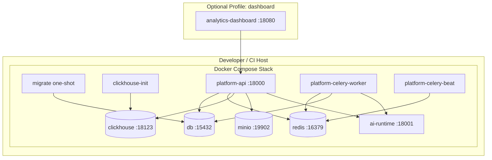

### CI/CD Pipeline

| Step | Tool | Scope |
|------|------|-------|
| Lint | `ruff check` | Entire workspace |
| Format | `ruff format --check` | Entire workspace |
| Security | `bandit` | `packages/`, `services/` |
| Dependencies | `pip-audit` | Locked deps |
| Types | `pyright` | contracts, foundation, both services |
| Tests | `pytest` | `tests/`, `services/ai-runtime/tests` |

Triggered on push to `main`/`dev` and all pull requests (`.github/workflows/ci.yml`).

### Configuration & Secrets

Configuration is **environment-variable driven** via Pydantic Settings (`platform_service.config`, `ai_runtime.config`). Root `.env` is loaded at startup (see `.env.example`).

**Platform — database & infra:**

| Variable | Purpose |
|----------|---------|
| `DATABASE_URL` / `database_url` | PostgreSQL async connection |
| `REDIS_URL` / `redis_url` | Celery broker + rate limiting |
| `CLICKHOUSE_HOST`, `CLICKHOUSE_PORT` | Analytics DB |
| `OBJECT_STORAGE_*` | Object storage backend (`minio`\|`s3`), endpoint, credentials, bucket, presign mode |
| `API_ROOT_PATH` | Public route prefix (default `/medtronics-api`) |

**Platform — AI orchestration:**

| Variable | Purpose |
|----------|---------|
| `AI_RUNTIME_BASE_URL` | ai-runtime HTTP base |
| `AI_RUNTIME_TOKEN` | `X-Internal-Token` for internal calls |
| `EMBEDDING_DIMENSION` | Corpus embedding dimension (must match ai-runtime; pgvector column typmod when using that adapter) |
| `VECTOR_STORE_BACKEND` | Durable vector backend (`pgvector` today). Call sites use `mc_foundation.VectorStore`. |

Platform does **not** select inference models. ai-runtime owns model id and
generation budgets (`max_tokens`, `temperature`) via `generation_profiles`
keyed by `generation_type`; platform only sends the role plus prompt/content
constraints on `InferenceRequest`.

**Deploy order:** restart/deploy **ai-runtime** before **platform** when
cutting over (shared monorepo contracts). Stage C (`module_identification`)
defaults to `max_tokens=12000` in code (not the former compose `32768`
override).

**Platform — auth:**

| Variable | Purpose |
|----------|---------|
| `SPICE_AUTH_ENABLED` | Enable external auth (default `false` locally) |
| `SPICE_AUTH_BASE_URL` | SPICE auth-service root |
| `SPICE_ADMIN_PATH_PREFIXES`, `SPICE_DEVICE_PATH_PREFIXES` | Authorization plane routing |

**ai-runtime — provider credentials:**

| Variable | Purpose |
|----------|---------|
| `GOOGLE_USE_VERTEX` | Vertex AI vs Developer API |
| `GOOGLE_CLOUD_PROJECT`, `GOOGLE_CLOUD_LOCATION` | Vertex config |
| `GOOGLE_APPLICATION_CREDENTIALS` | Service account JSON path |
| `GOOGLE_API_KEY` / `GEMINI_API_KEY` | Developer API fallback |
| `INTERNAL_TOKEN` | Validates platform requests |

---

## 9. Architectural Decisions

### 9.1 — Split Platform and AI Runtime

**Status**: Accepted (explicit in `README.md`, enforced by import rules)
**Context**: Platform needs durable state and orchestration; LLM providers change frequently and have heavy SDK dependencies.
**Decision**: Two deployable services — stateful `platform` and stateless `ai-runtime` — communicating via `AIRuntimeClient` over HTTP with a shared internal token.
**Rationale**: Keeps provider SDKs out of platform; allows independent scaling and credential isolation for AI calls.
**Trade-offs**:
- ✅ Clear ownership boundary; platform is system of record
- ✅ ai-runtime can be swapped or scaled without touching DB code
- ⚠️ Extra network hop and operational surface (two services to deploy/monitor)
- ⚠️ Platform must assemble fully-resolved `InferenceRequest` objects (more contract surface)

**Alternatives considered**: Monolith with inline SDK calls — rejected to prevent platform from importing `google.generativeai` (see `.cursor/rules/repo-overview.mdc`).

### 9.2 — Module-Centric Model (Not Scenario-Centric)

**Status**: Accepted (`docs/ARCHITECTURE_RESET.md`)
**Context**: Earlier v3.3 docs assumed scenario/counselling-centric routes and per-card IDs.
**Decision**: **Module** is the unit of meaning; cards are inline JSON slices with no stable IDs. Device sync uses `/sync/*`; legacy `/coaching/counselling` routes are not implemented on platform-api.
**Rationale**: Matches offline sync model; simplifies versioning and merge semantics.
**Trade-offs**:
- ✅ Cleaner sync contract for Android SDK
- ✅ Versioning via `module_family_id` + `version`
- ⚠️ Breaking change from legacy scenario APIs
- ⚠️ Card-level analytics rely on position indices, not card IDs

### 9.3 — Auto-Publish Pipeline (No Reviewer Gate)

**Status**: Accepted (`docs/ARCHITECTURE_RESET.md`)
**Context**: Need fast content pipeline without blocking CHWs on human review queues.
**Decision**: Pipeline publishes modules directly (`lifecycle_status=published`, `clinically_reviewed=false`). Dashboard is a correction surface, not a publish gate.
**Rationale**: Half-published modules are worse than missing modules; clinicians flag review post-hoc.
**Trade-offs**:
- ✅ Faster time-to-device for new content
- ✅ Failed candidates are skipped, not partially shipped
- ⚠️ Unreviewed content can reach devices until admin sets `clinically_reviewed`
- ⚠️ Requires strong pipeline quality monitoring (`/dashboard/llm-quality`)

### 9.4 — Unified Internal Generation Endpoint

**Status**: Accepted (explicit in `README.md`)
**Context**: Multiple generation types (extract, identify, draft, RAG, quiz) share provider plumbing.
**Decision**: Single route `POST /internal/generate/{generation_type}` with enum-validated types in `mc_contracts`.
**Rationale**: One adapter path; generation type selects prompt template and parser.
**Trade-offs**:
- ✅ Less route sprawl in ai-runtime
- ✅ Shared retry, logging, and token accounting
- ⚠️ Large enum surface; contract changes affect all generation types

### 9.5 — Polyglot Persistence

**Status**: Accepted (inferred from implementation)
**Context**: Transactional module data vs high-volume telemetry vs job queue have different access patterns.
**Decision**: PostgreSQL (OLTP; vectors via `VectorStore` with pgvector as the default adapter), ClickHouse (telemetry OLAP), Redis (queue), object storage via `ObjectStore` (MinIO or AWS S3).
**Rationale**: Right tool per workload; ClickHouse ReplacingMergeTree for idempotent telemetry replay.
**Trade-offs**:
- ✅ Optimized read paths for dashboards and sync
- ⚠️ Four data systems to operate and back up
- ⚠️ No distributed transactions across stores — eventual consistency for telemetry-driven gap state

### 9.6 — No Celery Result Backend

**Status**: Accepted (documented in `celery_app.py`)
**Context**: Task outcomes are already persisted in PostgreSQL (`ingestion_run_step`, `module.lifecycle_status`).
**Decision**: Redis is broker only; poll DB rows for progress.
**Rationale**: Avoid duplicate state; admin ingest poll endpoints read `ingestion_run` tables.
**Trade-offs**:
- ✅ Single source of truth for job status
- ⚠️ Celery task failure without DB write may be harder to surface

---

## 10. Cross-Cutting Concerns

### Authentication & Authorization

When `SPICE_AUTH_ENABLED=true`:

1. **SpiceAuthMiddleware** validates JWT via SPICE `POST /authenticate` (exempt: `health`, `ready`).
2. **SpiceAuthorizationMiddleware** enforces **admin** vs **device** planes by path prefix — strict partition; `SUPER_USER` may access both.
3. Default local/docker: auth disabled for smoke tests.

Headers: `Authorization: Bearer <jwt>`, optional `client` (`web` for admin, `mob` for Android).

### Error Handling

- All HTTP errors from platform and ai-runtime return **RFC 7807 Problem Details**
  (`Content-Type: application/problem+json`) with a stable `code` extension.
  Canonical shape:

  ```json
  {
    "type": "docs/error-codes.json#batch_not_found",
    "title": "Batch Not Found",
    "status": 404,
    "detail": "ingest batch not found",
    "instance": "/admin/ingest/batches/{id}",
    "code": "batch_not_found"
  }
  ```

- Clients map `code` → user-facing copy. `detail` is technical/debug text only.
- Client catalogue: `docs/error-codes.json`. Server enum: `mc_contracts.errors.ErrorCode`.
  Runtime primitive: `mc_foundation.problem.AppError`.
- Request validation (`422`) is one problem with an `errors[]` extension (field locations).
- Unexpected failures return `500` with `code: internal_error` and a generic detail; stacks stay in logs.
- Readiness `503` uses `code: service_unavailable` and extension `checks` (per-dependency map).
- Failed ingest steps persist first-class `ingestion_run_step.error_code` / `error_message`
  (plus optional `error_jsonb` context). Batch/run poll nodes expose `error_code` and `error_message`.
- Platform’s `AIRuntimeClient` parses ai-runtime Problem Details and re-raises `AppError` with the
  **same** `code` (no remapping). Transport failures use `ai_runtime_unreachable`.

### Observability

- **Logging**: `mc_foundation.logging.setup_logging` — JSON logs in production (`log_json=true` in compose).
- **Request correlation**: `RequestIdMiddleware` on both services.
- **Health**: `/ready` (platform dependency matrix); ai-runtime `/health` (liveness).
- **Metrics/tracing**: No dedicated APM integration detected in codebase — relies on structured logs.

### Configuration Management

- Pydantic Settings classes with env var aliases (lowercase in compose, uppercase in CI).
- `.env` loaded before settings in both entrypoints (for `GOOGLE_APPLICATION_CREDENTIALS` and other SDK env reads).
- Alembic migrations are **never** run at app startup — explicit `migrate` container or manual `alembic upgrade head`.

---

## Appendix A — Dependency Graph

Allowed import boundaries (enforced by convention and `.cursor/rules/repo-overview.mdc`):

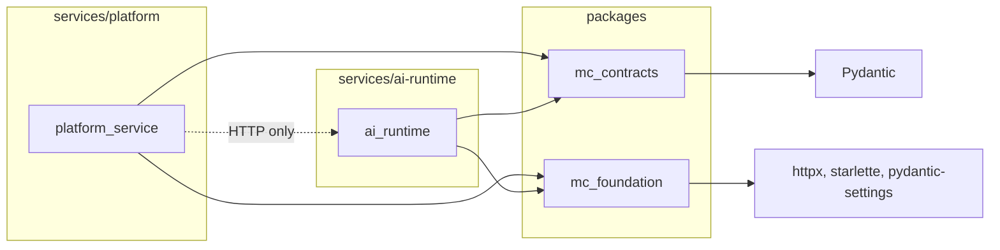

**Forbidden**: `ai-runtime` → `platform`; `platform` → LLM SDKs; `foundation` → SQLAlchemy models; `contracts` → runtime behavior.

---

## Appendix B — Annotated File Structure

```
coaching-platform/
├── pyproject.toml              # uv workspace root (5 members)
├── uv.lock                     # Locked dependency versions
├── docker-compose.yml          # Full local stack (db, redis, ch, minio, services)
├── .env.example                # Required env template (GOOGLE_API_KEY, etc.)
├── README.md                   # Canonical API contract + quick start
├── CLAUDE.md                   # AI assistant entry point
│
├── packages/
│   ├── contracts/src/mc_contracts/   # Shared Pydantic DTOs and enums
│   └── foundation/src/mc_foundation/ # Logging, config base, middleware
│
├── services/
│   ├── platform/
│   │   ├── Dockerfile
│   │   └── src/platform_service/
│   │       ├── main.py             # FastAPI app factory
│   │       ├── config.py           # Settings
│   │       ├── api/                # Route handlers (10 routers)
│   │       ├── auth/               # SPICE + rate limit middleware
│   │       ├── db/models/          # SQLAlchemy models (~20 entities)
│   │       ├── integrations/       # AIRuntimeClient
│   │       ├── workers/            # Ingest pipeline + post-publish jobs
│   │       ├── celery_app.py       # Celery config + beat schedule
│   │       └── celery_tasks.py     # Task entrypoints
│   └── ai-runtime/
│       ├── Dockerfile
│       └── src/ai_runtime/
│           ├── main.py             # Stateless FastAPI app
│           ├── api/                # internal_generate, embed, transcribe
│           ├── providers/          # Google adapter
│           └── services/           # prompt_executor
│
├── infra/
│   ├── alembic/                    # Migration versions + env.py
│   ├── alembic.ini
│   └── clickhouse/init.sql         # coaching_events + materialized views
│
├── tests/                          # Platform integration tests (~123 files)
├── docs/                           # Operational and architecture docs
└── .github/workflows/ci.yml        # Lint, security, pyright, pytest
```

---

## Appendix C — Known Unknowns

- [ ] **Production deployment topology** — Compose documents local dev; no Terraform/Kubernetes manifests in this repo for prod networking, IAM, or multi-region layout.
- [ ] **SPICE auth-service internals** — Integration contract is documented in README; auth-service implementation lives outside this repo.
- [ ] **Android SDK sync client** — Device-side caching and offline behavior are out of scope per `ARCHITECTURE_RESET.md`.
- [ ] **`GET /dashboard/district/{upazila_id}`** — Returns `501 Not Implemented`; district analytics design TBD.
- [ ] **Legacy routes** — `POST /coaching/counselling`, quiz-answer, it-help, and scenario-centric admin routes are listed in historical docs but not implemented on platform-api.
- [ ] **APM / distributed tracing** — Structured logging only; no OpenTelemetry or Datadog integration found in source.
- [ ] **Rate limiting coverage** — Middleware exists; README notes device-plane rate limiting as recommended future work.
- [ ] **Embedding model alignment** — Compose defaults differ slightly between platform (`text-embedding-005`) and ai-runtime (`gemini-embedding-001`); `EMBEDDING_DIMENSION` must be kept consistent across services.
