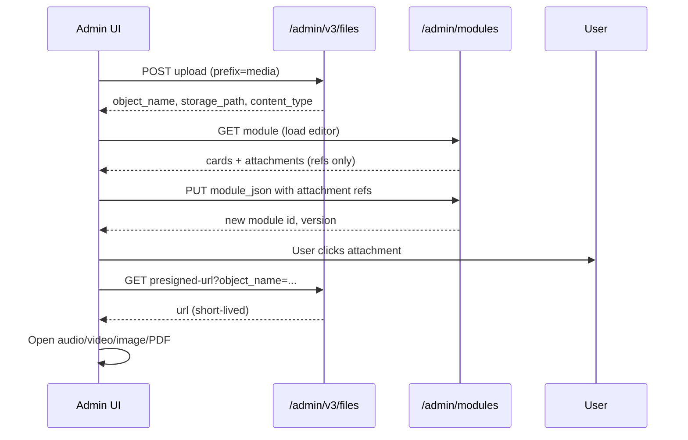

# Frontend integration guide — module attachments

This document describes how the admin UI should integrate **file and YouTube attachments** on coaching modules and cards.

**Base URL (local):** `http://localhost:8000`

**Auth (after rebase onto `optimal-ingest`):** admin routes sit under the SPICE auth plane (`spice_admin_path_prefixes` includes `admin`). Send the same SPICE session/token headers your other admin calls use (e.g. ingest). Optionally set audit identity:

```http
X-Admin-Caller-Id: <editor-user-id>
```

File upload and presign live at `/admin/v3/files` (plus your deployment’s `api_root_path` prefix if configured, e.g. `/medtronics-api/admin/v3/files`).

**Note:** `X-Admin-File-Token` is **not** used on `optimal-ingest`; do not send it for module attachments.

---

## 1. Overview

| Concept | Behavior |
|--------|----------|
| Where attachments live | Inside `module_json` — module-level `attachments[]` and/or per-card `cards[i].attachments[]` |
| File bytes | Uploaded separately to MinIO; module only stores **references** (`object_name`, `storage_path`, …) |
| Playback / preview | **On demand** — module GET does **not** return presigned URLs; call presign when the user opens a file |
| Module save | `PUT /admin/modules/{id}` creates a **new version** (new `id`); always use the returned `id` after save |
| Ingest API | **Do not use** `/admin/v3/ingest*` for editor attachments — that is the AI source-document pipeline |



---

## 2. Supported attachment types

### 2.1 File uploads (`kind: "file"`)

Upload via `POST /admin/v3/files` with `prefix=media`.

| Category | Extensions | `media_kind` value |
|----------|------------|-------------------|
| Image | `.jpg`, `.jpeg`, `.png`, `.webp` | `image` |
| PDF | `.pdf` | `pdf` |
| Audio | `.mp3`, `.wav`, `.m4a`, `.flac`, `.ogg`, `.webm` | `audio` |
| Video | `.mp4`, `.mov`, `.mkv` | `video` |

`media_kind` must match the file extension (server validates on save).

### 2.2 YouTube (`kind: "youtube"`)

No upload step. User pastes a URL; server normalizes it and sets `youtube_video_id` on save.

Accepted hosts: `youtube.com`, `www.youtube.com`, `youtu.be`, `m.youtube.com`.

---

## 3. Data shapes (TypeScript-friendly)

### 3.1 File attachment (stored in `module_json`)

```typescript
type ModuleFileAttachment = {
  kind: "file";
  attachment_id: string;       // UUID you generate client-side
  label?: string;
  sort_order?: number;           // default 0
  storage_path: string;          // from upload response
  object_name: string;           // from upload response — use for presign
  content_type: string;          // from upload response
  original_filename?: string;    // display name (UI-provided)
  media_kind: "image" | "audio" | "video" | "pdf";
};
```

### 3.2 YouTube attachment

```typescript
type ModuleYoutubeAttachment = {
  kind: "youtube";
  attachment_id: string;
  label?: string;
  sort_order?: number;
  youtube_url: string;           // user input; server normalizes on PUT
  youtube_video_id?: string;     // returned on GET after save
};
```

### 3.3 Where to attach

```typescript
type ModuleJson = {
  cards: Array<{
    card_family_id?: string;
    title_bn: string;
    body_bn?: string;
    // ... other card fields from GET ...
    attachments?: ModuleAttachment[];
  }>;
  attachments?: ModuleAttachment[];  // module-level (optional)
};

type ModuleAttachment = ModuleFileAttachment | ModuleYoutubeAttachment;
```

- **Module-level** `attachments`: supplementary material for the whole module.
- **Card-level** `cards[i].attachments`: tied to a specific card (use existing `card_family_id` when editing).

---

## 4. API sequence

### Step A — Upload file (when user picks a file)

```http
POST /admin/v3/files
Content-Type: multipart/form-data
<SPICE auth headers> + optional X-Admin-Caller-Id

file: <binary>
prefix: media
```

**Response `201`:**

```json
{
  "bucket_name": "medtronics-storage",
  "object_name": "media/2bb43346-36bd-42ea-99b8-c6347b94f3bd_audio.mp3",
  "storage_path": "medtronics-storage/media/2bb43346-36bd-42ea-99b8-c6347b94f3bd_audio.mp3",
  "content_type": "audio/mpeg",
  "size_bytes": 3813041
}
```

**Map to attachment ref** (keep in local editor state until save):

```typescript
function buildFileAttachment(upload: FileUploadResponse, file: File): ModuleFileAttachment {
  const ext = file.name.slice(file.name.lastIndexOf(".")).toLowerCase();
  return {
    kind: "file",
    attachment_id: crypto.randomUUID(),
    storage_path: upload.storage_path,
    object_name: upload.object_name,
    content_type: upload.content_type,
    original_filename: file.name,
    media_kind: mediaKindFromExtension(ext),
    sort_order: 0,
  };
}
```

**Errors:** `400` unsupported type, `413` too large, `401` bad token, `502` storage failure.

---

### Step B — Load module (open editor)

```http
GET /admin/modules/{module_id}
```

**Use from response:**

- `cards` — include existing `attachments` on each card when building the editor model.
- `attachments` — top-level module attachments (new field on `ModuleDetail`).
- Shell fields: `title_bn`, `title_en`, `description_bn`, `quiz`, etc.

**Important:** file attachments on GET have **`object_name` only** — no `presigned_url`. Do not expect or cache a play URL from this call.

---

### Step C — Save module (user clicks Save)

```http
PUT /admin/modules/{module_id}
Content-Type: application/json

{
  "title_bn": "...",
  "title_en": "...",
  "description_bn": "...",
  "module_json": {
    "cards": [ /* full card array with attachments merged in */ ],
    "attachments": [ /* module-level attachments */ ]
  },
  "editor_id": "<optional-uuid>"
}
```

**Rules:**

1. Send the **full** `module_json` (cards + attachments), not a partial patch.
2. Include every attachment the user should keep (removing from the array removes it on the new version).
3. Do **not** send `presigned_url` on PUT.
4. For new file attachments, only send refs built from the upload response (Step A).
5. For YouTube, send `kind: "youtube"` + `youtube_url` + new `attachment_id`.

**Response `200`:**

```json
{
  "id": "b5f8651b-00ec-4397-a563-956fa12b956d",
  "module_family_id": "78c7f324-0e1b-4c89-a86d-945903804ea5",
  "version": 2,
  "supersedes_module_id": "df3ba2fa-1bb9-4a96-8fa9-7c1f6550889e"
}
```

**After save:** navigate / refetch using **`response.id`** (new version id), not the old `module_id`.

**Validation errors `400`:**

```json
{
  "detail": {
    "code": "invalid_attachment_object_prefix",
    "message": "..."
  }
}
```

| `code` | Meaning | UI action |
|--------|---------|-----------|
| `invalid_attachment_object_prefix` | `object_name` must start with `media/` | Re-upload with `prefix=media` |
| `unsupported_attachment_suffix` | Extension not allowed | Show allowed types |
| `attachment_media_kind_mismatch` | `media_kind` does not match file type | Fix mapping from extension |
| `attachment_object_not_found` | File not in MinIO | Re-upload |
| `duplicate_attachment_id` | Same `attachment_id` twice | Regenerate UUID |
| `too_many_module_attachments` | Max 20 module-level | Show limit message |
| `too_many_card_attachments` | Max 10 per card | Show limit message |
| `invalid_youtube_url` | Bad YouTube link | Ask user to fix URL |

---

### Step D — Preview / play file (user clicks attachment)

```http
GET /admin/v3/files/presigned-url?object_name={encodeURIComponent(object_name)}&disposition=inline&expires_seconds=3600
<SPICE auth headers> + optional X-Admin-Caller-Id
```

| Query param | Recommendation |
|-------------|------------------|
| `object_name` | From attachment ref (required) |
| `disposition` | `inline` for preview/play in browser |
| `expires_seconds` | `600`–`3600` (max often `86400` per env) |

**Response `200`:**

```json
{
  "url": "http://localhost:9002/medtronics-storage/media/...?...",
  "bucket_name": "medtronics-storage",
  "object_name": "media/...",
  "expires_seconds": 3600
}
```

**UI usage:**

```typescript
async function openFileAttachment(att: ModuleFileAttachment) {
  const res = await fetch(
    `/admin/v3/files/presigned-url?object_name=${encodeURIComponent(att.object_name)}&disposition=inline&expires_seconds=3600`,
    { headers: { /* SPICE auth headers */, "X-Admin-Caller-Id": callerId } }
  );
  if (!res.ok) throw new Error("presign failed");
  const { url } = await res.json();

  switch (att.media_kind) {
    case "audio":
      // <audio src={url} controls />
      break;
    case "video":
      // <video src={url} controls />
      break;
    case "image":
      // 
      break;
    case "pdf":
      // window.open(url) or embed PDF viewer
      break;
  }
}
```

**Presign caching:** cache `{ url, expiresAt }` in memory only until `expiresAt`. On 403 or failed load, presign again. Do not persist URLs in `module_json`.

**YouTube:** embed with `youtube_video_id` or `youtube_url` from GET — no presign call.

---

## 5. Recommended UI flows

### 5.1 Add file to a card

1. User on module edit screen → `GET /admin/modules/{id}`.
2. User clicks “Add attachment” on card *N*.
3. File picker → `POST /admin/v3/files` → build `ModuleFileAttachment`.
4. Append to `cards[N].attachments` in **local state** (show thumbnail/name).
5. User clicks Save → `PUT` full `module_json` → replace route/state with new `id` from response.
6. Optional: `GET` new module to refresh server-normalized YouTube fields.

### 5.2 Add file at module level

Same as above, but append to `module_json.attachments` instead of a card.

### 5.3 Add YouTube link

1. User pastes URL in dialog.
2. Append `{ kind: "youtube", attachment_id: uuid(), youtube_url: "..." }` to state.
3. Save via `PUT` — server returns normalized `youtube_url` + `youtube_video_id` on next `GET`.

### 5.4 Remove attachment

Remove item from `attachments` array in local state → `PUT` — no separate delete API in v1.

### 5.5 Publish (if your UI has a publish action)

```http
POST /admin/modules/{module_id}/clinically-reviewed
{ "clinically_reviewed": true, "reviewer_id": "<uuid>" }
```

Use the **latest** module version `id` after edits.

---

## 6. Editor state checklist

| State | Source |
|-------|--------|
| Module shell | `GET /admin/modules/{id}` |
| Cards + text | `response.cards` |
| Module attachments | `response.attachments` |
| Pending uploads | Local only until PUT (upload response → attachment ref) |
| Play URL | Presign on click only; never stored in save payload |

**On PUT payload:**

```typescript
{
  module_json: {
    cards: editor.cards,           // include all card fields you got from GET + edits
    attachments: editor.moduleAttachments,
  },
}
```

Preserve `card_family_id` on each card when present (needed for telemetry/runtime; do not drop on edit).

---

## 7. Limits and env

| Limit | Value |
|-------|--------|
| Module-level attachments | 20 |
| Per-card attachments | 10 |
| Upload max size | `104857600` bytes (100 MB) default |
| Object key prefix | `media/` required |
| Presign TTL | Query param; typical 600–3600 s |

---

## 8. What not to do

- Do not multipart-upload files on `PUT /admin/modules/{id}`.
- Do not put `presigned_url` in `module_json` when saving.
- Do not use ingest APIs for module editor attachments.
- Do not keep using old `module_id` after PUT — always switch to returned `id`.
- Do not rely on `HEAD` against presigned URLs for MinIO (use GET / `<audio src>` / `<video src>`).

---

## 9. Example end-to-end (curl)

```bash
TOKEN="dev-admin-file-token"
BASE="http://localhost:8000"
MODULE_ID="<existing-module-uuid>"

# 1. Upload
curl -s -X POST "$BASE/admin/v3/files" \
  -H "X-Admin-Caller-Id: editor@example.com" \
  # plus SPICE Authorization header(s) as for other admin routes
  -F "file=@./audio.mp3" \
  -F "prefix=media"

# 2. Save (use upload fields in module_json.attachments or cards[].attachments)
curl -s -X PUT "$BASE/admin/modules/$MODULE_ID" \
  -H "Content-Type: application/json" \
  -d @payload.json

# 3. Load new version
NEW_ID="<id from PUT response>"
curl -s "$BASE/admin/modules/$NEW_ID"

# 4. On user click
curl -s "$BASE/admin/v3/files/presigned-url?object_name=media%2F...&disposition=inline" \
  -H "X-Admin-Caller-Id: editor@example.com"
```

---

## 10. OpenAPI / discovery

- Module routes: `GET /docs` → **admin-dashboard** tag.
- File routes: **admin-files** tag (`/admin/v3/files`, `/admin/v3/files/presigned-url`).

---

## 11. Questions / backend contacts

- Attachment schema: `packages/contracts/src/mc_contracts/module_attachments.py`
- Validation errors: `services/platform/src/platform_service/services/module_attachment_validator.py`
- Module API: `services/platform/src/platform_service/api/admin_modules.py`
