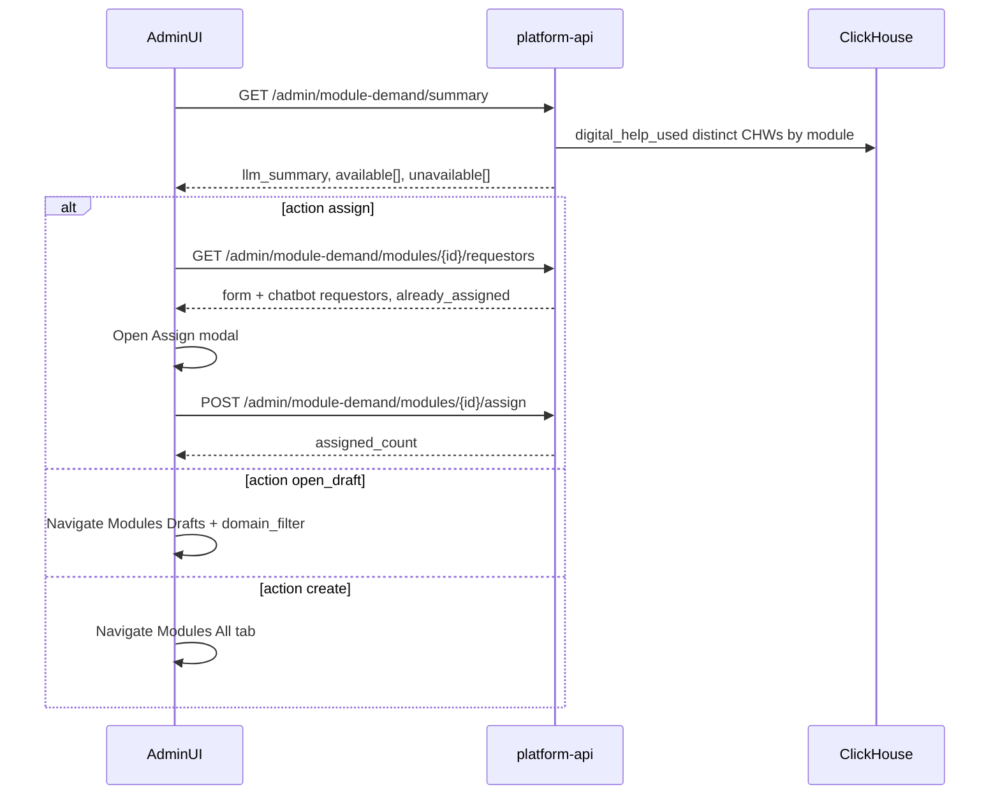

# Admin module demand summary — frontend integration plan

Companion doc for the **module demand summary** backend APIs. UI lives in the **admin dashboard** (not this repo).

**API base (local):** `http://localhost:18000/medtronics-api` (or deployment `API_ROOT_PATH`).

---

## Scope (this phase)

| In scope | Out of scope (later phases) |
|---|---|
| LLM narrative + top-K demand from **form** + **chatbot** (`digital_help_used`) | New chatbot capture schema (reuse existing telemetry) |
| Configurable K via Configuration (`module_demand_top_k`) | One-click auto-assign when a module is published |
| Deep-links: assign modal / Drafts+topic / Create on All tab | Building admin UI **inside this monorepo** |
| Bulk assign from requestor list with audit | Changing device training-request immediate-access behavior |
| Requestor `source`: `form` \| `chatbot` | |

---

## Admin UI implementation checklist (admin FE repo)

Wire these screens against the APIs below.

### A) Configuration page

1. Load `GET /admin/configs`.
2. Show editable control for key `module_demand_top_k` (title: “Module Demand Top K”).
3. Save with `PUT /admin/configs/module_demand_top_k` body `{ "value_json": <number> }`.
4. Refresh demand summary after save (summary reads this config; no query override).

### B) Demand summary view (Dashboard / Insights)

1. Call `GET /admin/module-demand/summary`.
2. Render `llm_summary` as the narrative.
3. Render two lists: `available[]` and `unavailable[]`.
4. Each row is clickable based on `action`:

| `action` | UI behavior |
|---|---|
| `assign` | Open **Assign Module** modal for `module_id` |
| `open_draft` | Navigate to Modules with Drafts tab + topic filter |
| `create` | Navigate to Modules with All tab (create flow) |

Suggested Modules deep-links (derive tab from `action`):

- Draft (`open_draft`): `/modules?tab=drafts&domain=<domain_filter>`
- Create (`create`): `/modules?tab=all` (or your create-entry route with All tab selected)

### C) Assign Module modal (published / `action=assign`)

1. On open: `GET /admin/module-demand/modules/{module_id}/requestors`.
2. Show checkbox list of `requestors[]`.
3. Pre-check when `already_assigned === true`.
4. Show source chip: `Form` when `source === "form"`, `Chatbot` when `source === "chatbot"`.
5. Primary button “Assign selected” → `POST /admin/module-demand/modules/{module_id}/assign` with `{ "user_ids": [...] }` (all checked users). Prefer “assign all requestors” that selects every row then submits. (Same assignments router as `POST /admin/assignments`; demand path adds `module_demand_assigned` audit.)
6. Do **not** use raw `POST /admin/assignments` from this modal (audit uses `module_demand_assigned`).

### D) Create New Module (`action=create`)

1. Show **Create New Module** on unavailable rows.
2. Click → Modules page, **All** tab (`action: "create"`).

---

## Ticket → API mapping

| UI requirement | Frontend approach | Backend |
|---|---|---|
| Show LLM demand summary | Render `llm_summary` + lists | `GET /admin/module-demand/summary` |
| Configurable Top K | Configuration page | `GET/PUT /admin/configs` → `module_demand_top_k` |
| Available vs unavailable | Split `available[]` / `unavailable[]` | Same summary response |
| Click published module | Assign Module modal | `action: "assign"` + requestors/assign |
| Click draft module | Modules → Drafts + topic | `open_draft`, `domain_filter` |
| Missing module | Modules → All (create) | `create` |
| Requestor list + source | Checkboxes + Form/Chatbot chip | `GET .../requestors` |
| Pre-check assigned | `already_assigned` | Same response |
| Assign all selected | Single submit | `POST .../assign` |

---

## End-to-end flow



---

## 1) Configuration — Top K

```http
GET /admin/configs
PUT /admin/configs/module_demand_top_k
```

```typescript
type ConfigUpdate = {
  value_json: number;
  title?: string;
  description?: string;
};
```

---

## 2) `GET /admin/module-demand/summary`

```http
GET /admin/module-demand/summary
GET /admin/module-demand/summary?tenant_id=<uuid>
```

Optional `tenant_id` follows other admin list routes (admin override when SPICE auth is on).

The summary is **precomputed daily** by a Celery beat job and served from a Postgres snapshot; on a cache miss (e.g. before the first run) it falls back to a live build. `generated_at` reflects when the served snapshot was computed.

ClickHouse chatbot contribution is **soft-failed**: if CH is down, form demand still returns (unlike pure dashboard analytics routes that return 502 when analytics are unavailable).

```typescript
type ModuleDemandItem = {
  display_name: string;
  request_count: number; // distinct CHWs (form ∪ chatbot)
  module_id: string | null;
  lifecycle_status: string | null;
  domain: string | null;
  action: "assign" | "open_draft" | "create";
  domain_filter: string | null; // set for open_draft (topic filter)
};

type ModuleDemandSummaryResponse = {
  top_k: number;
  generated_at: string;
  llm_summary: string;
  available: ModuleDemandItem[];
  unavailable: ModuleDemandItem[];
};
```

**Demand sources**

- **Form:** `chw_training_request` rows (including free-text → create / title-match).
- **Chatbot:** existing `digital_help_used` telemetry keyed on `module_id` (last 30 days). Demand is attributed to the concrete module version; events without a `module_id` are ignored (no family roll-up). Soft-fails if ClickHouse is down.

`available` includes published (`assign`) and draft (`open_draft`).

---

## 3) `GET /admin/module-demand/modules/{module_id}/requestors`

```typescript
type ModuleDemandRequestor = {
  chw_id: number;
  chw_name: string | null;
  source: "form" | "chatbot";
  requested_at: string;
  already_assigned: boolean;
  request_id: string | null; // set for form; null for chatbot
};

type ModuleDemandRequestorsResponse = {
  module_id: string;
  module_title: string;
  requestors: ModuleDemandRequestor[];
};
```

- One row per distinct `chw_id`. If both form and chatbot, **form wins**.
- Pre-check when `already_assigned === true` (individual assignments).

---

## 4) `POST /admin/module-demand/modules/{module_id}/assign`

```http
POST /admin/module-demand/modules/{module_id}/assign
Content-Type: application/json
```

```typescript
type ModuleDemandAssignRequest = { user_ids: number[] };
type ModuleDemandAssignResponse = {
  assigned_count: number;
  assignment_ids: string[];
};
```

`user_ids` must exist in `GET /admin/users`.

---

## Suggested UI placement

1. **Dashboard / Insights:** demand summary + Assign modal.
2. **Configuration:** `module_demand_top_k`.
3. **Modules page:** honor `?tab=drafts|all&domain=...` from demand deep-links.

---

## Explicit non-goals

- Writing a new chatbot event type / table (reuse `digital_help_used`).
- Auto-assign on publish to pending requestors.
- Admin UI code living in this monorepo.
