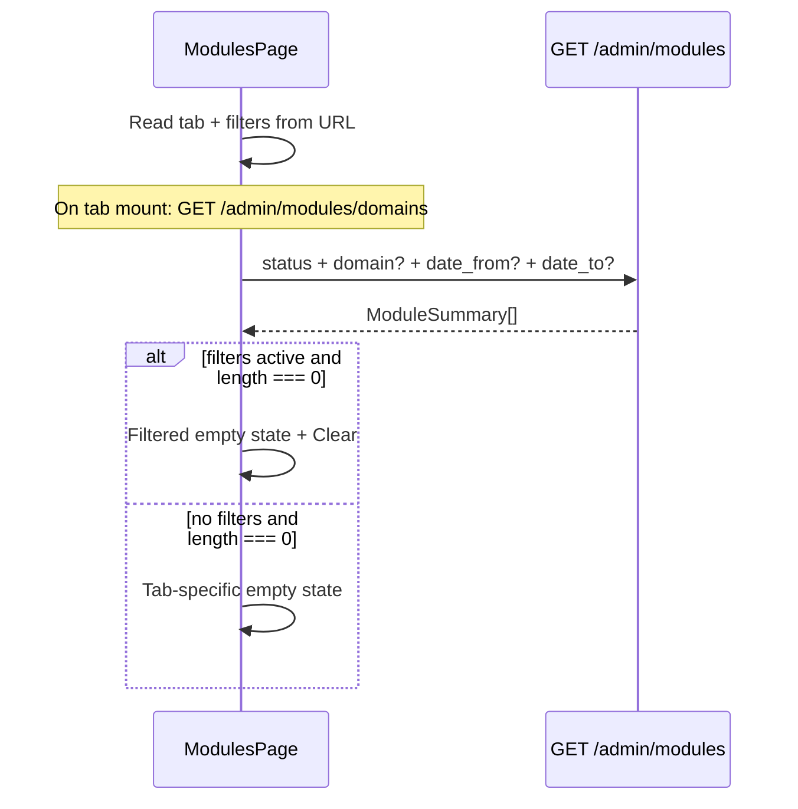

# Admin modules listing — domain & date filters (frontend plan)

Companion doc for MR **feat/admin-modules-topic-date-filters**. Backend adds tab-aware date filtering on the existing module list endpoint; domain filtering uses the `domain` query param; domain dropdown options use `GET /admin/modules/domains`.

**API base (local):** `http://localhost:18000/medtronics-api` (or your deployment `API_ROOT_PATH`).

---

## Ticket → API mapping

| Ticket requirement | Frontend approach | Backend |
|---|---|---|
| Domain filter on All / Published / Drafts | `domain` query param | `GET /admin/modules?domain=<domain>` |
| Domain dropdown options | `GET /admin/modules/domains?status=…` | `GET /admin/modules/domains` |
| Date range filter | `date_from` / `date_to` ISO strings | `GET /admin/modules?date_from=…&date_to=…` |
| Tab-aware dates | Pass `status` matching active tab; server picks column | See table below |
| Combined filters | Send all params together | ANDed server-side |
| Clear filters | Remove params from URL, refetch | — |
| Persist within tab | URL search params per tab | — |
| Empty state | `length === 0` + filter-aware copy | — |

### Tab → query params

| Tab | `status` | Date column used by server |
|-----|----------|----------------------------|
| **All** | omit | `coalesce(published_at, created_at)` |
| **Published** | `published` | `published_at` |
| **Drafts** | `draft` | `created_at` |

**UI label** may still say "Topic"; the API field is `ModuleSummary.domain` (e.g. `clinical`, `rmnch`, `ncd`, `anc`, `hypertension`).

---

## List endpoint

```
GET /admin/modules
```

### Query parameters

| Param | Type | Notes |
|-------|------|-------|
| `status` | `draft` \| `published` \| `retired` | Omit for **All** (retired excluded by default) |
| `domain` | string | **Domain filter** (`module.domain`) |
| `date_from` | ISO 8601 datetime | Inclusive start |
| `date_to` | ISO 8601 datetime | Inclusive end — send end-of-day for calendar pickers |
| `limit` | int (1–200, default 50) | |
| `offset` | int (default 0) | |
| `latest_version_only` | bool (default `true`) | Keep default — one row per module family |

### Examples

```http
# Published tab, domain + date range
GET /admin/modules?status=published&domain=rmnch&date_from=2025-01-01T00:00:00Z&date_to=2025-06-30T23:59:59Z

# Drafts tab, date only
GET /admin/modules?status=draft&date_from=2025-03-01T00:00:00Z&date_to=2025-03-31T23:59:59Z

# All tab, domain only
GET /admin/modules?domain=clinical
```

### Validation

- `422` if `date_from > date_to` (validate client-side too for better UX).

### Response

```json
{
  "modules": [ /* ModuleSummary[] */ ],
  "total_modules": 123,
  "total_pages": 3,
  "limit": 50,
  "offset": 0
}
```

Each row includes `domain`, `lifecycle_status`, `created_at`, `published_at` (see `packages/contracts/src/mc_contracts/admin_modules.py`). `total_modules` / `total_pages` respect the same filters as the page.

---

## UI layout

```
[ All | Published | Drafts ]

Topic: [ All topics ▼ ]    From: [ date ]    To: [ date ]    [ Clear filters ]

┌ module list / cards ─────────────────────────────┐
│  …                                               │
└──────────────────────────────────────────────────┘
```

*(UI copy may keep "Topic"; wire it to `domain` / `/admin/modules/domains`.)*

---

## Data flow



---

## Implementation steps

### 1. URL-synced filter state (per tab)

Persist filters in the route so list → detail → back keeps them:

```
/modules?tab=published&domain=rmnch&from=2025-01-01&to=2025-06-30
```

- On tab change: keep separate filter state per tab (recommended) or reset — ticket requires persistence **within** the same tab.
- On filter change: update URL + refetch list.
- **Clear filters**: remove `domain`, `from`, `to` from URL and refetch.

### 2. List fetch helper

```typescript
type Tab = "all" | "published" | "drafts";

type ModuleFilters = {
  domain?: string;
  from?: Date;
  to?: Date;
};

function endOfDayUTC(d: Date): string {
  const x = new Date(d);
  x.setUTCHours(23, 59, 59, 999);
  return x.toISOString();
}

async function fetchModules(
  tab: Tab,
  filters: ModuleFilters,
  paging: { limit?: number; offset?: number } = {},
): Promise<ModuleSummary[]> {
  const params = new URLSearchParams();
  params.set("latest_version_only", "true");
  params.set("limit", String(paging.limit ?? 200));
  if (paging.offset) params.set("offset", String(paging.offset));

  if (tab === "published") params.set("status", "published");
  if (tab === "drafts") params.set("status", "draft");

  if (filters.domain) params.set("domain", filters.domain);
  if (filters.from) params.set("date_from", filters.from.toISOString());
  if (filters.to) params.set("date_to", endOfDayUTC(filters.to));

  return api.get(`/admin/modules?${params}`);
  // response: { modules, total_modules, total_pages, limit, offset }
}
```

### 3. Domain dropdown

```
GET /admin/modules/domains?status=published   # Published tab
GET /admin/modules/domains?status=draft       # Drafts tab
GET /admin/modules/domains                      # All tab (retired excluded)
```

Response: sorted `string[]` of distinct `module.domain` values.

```typescript
async function fetchDomainOptions(tab: Tab): Promise<string[]> {
  const params = new URLSearchParams();
  params.set("latest_version_only", "true");
  if (tab === "published") params.set("status", "published");
  if (tab === "drafts") params.set("status", "draft");
  return api.get(`/admin/modules/domains?${params}`);
}
```

Cache domain options per tab (e.g. 60s `staleTime`) — refresh when a module is created/edited with a new domain.

### 4. Suggested component structure

```
ModulesPage
├── ModuleStatusTabs              // All | Published | Drafts
├── ModuleListFilters             // domain select, date pickers, clear
│   └── useModuleListFilters()    // URL sync, per-tab state
├── ModuleList                    // existing table/cards
└── ModuleListEmptyState          // filtered vs unfiltered copy
```

### 5. Empty states

| Condition | Copy |
|-----------|------|
| Filters active, 0 results | “No modules match the selected filters. Try adjusting the topic or date range.” + **Clear filters** button |
| No filters, Published empty | “No published modules yet.” |
| No filters, Drafts empty | “No draft modules yet.” |
| No filters, All empty | “No modules yet.” |

### 6. Client-side validation

- Disable **Apply** or show inline error when `from > to` (mirrors API `422`).
- Optional: disable future dates if product requires it.

---

## QA checklist

- [ ] Domain filter works on **All**, **Published**, **Drafts**
- [ ] Date filter works on all three tabs (Published matches `published_at`)
- [ ] Domain + date combined on each tab
- [ ] Clear one filter / clear all restores expected list
- [ ] Filters persist on list → module detail → back (same tab)
- [ ] Tab switch behaviour matches product choice (per-tab filter memory vs reset)
- [ ] Domain dropdown shows only domains present in current tab
- [ ] Filtered empty state vs unfiltered empty state
- [ ] Pagination still works if list uses `offset` (filters sent on every page request)

---

## Out of scope (backend / this MR)

- Filter UI, clear button, empty-state components — frontend only
- `GET /admin/modules/domains` — lightweight distinct-domain list for dropdowns
